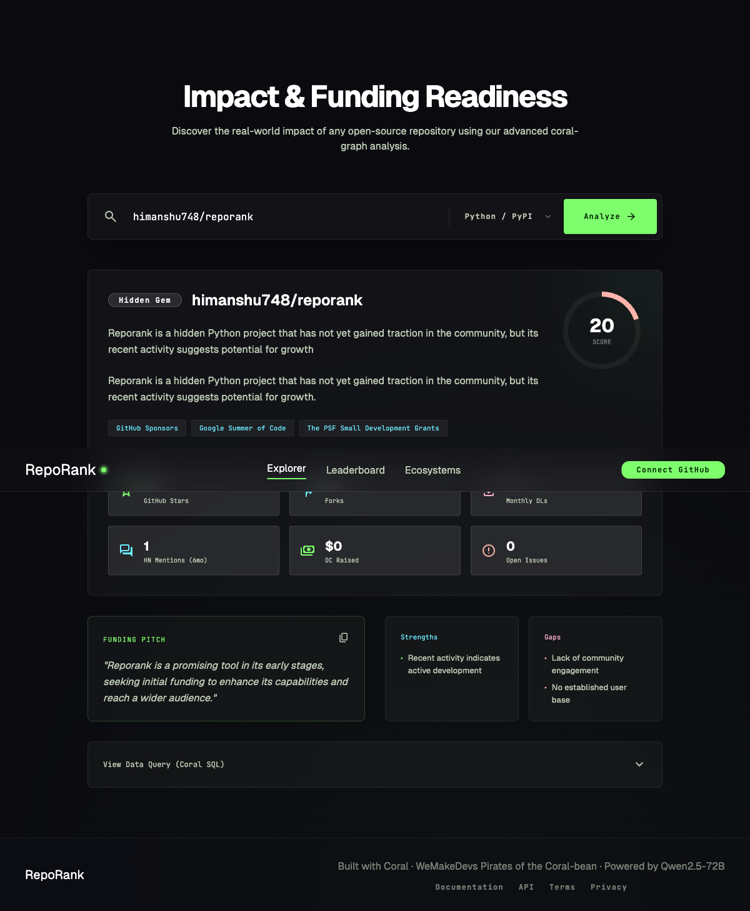
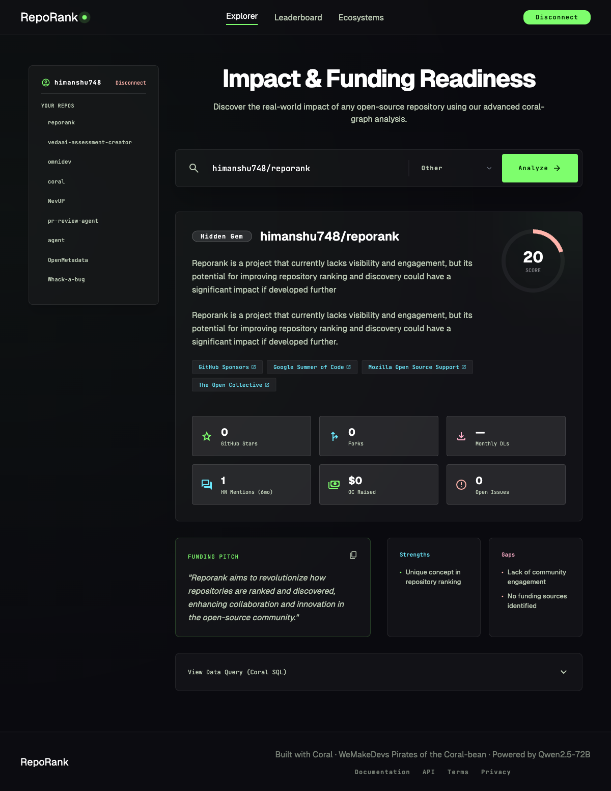
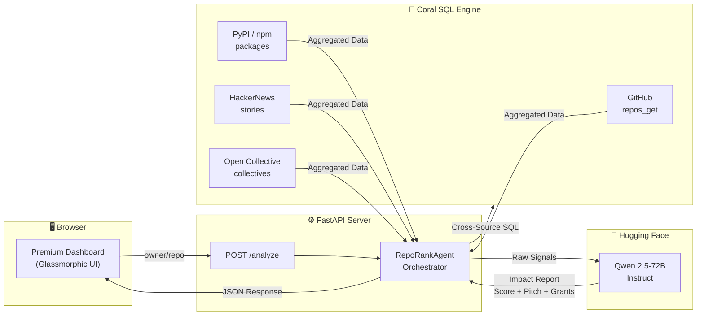

<div align="center">

# ☠️ RepoRank

### Open Source Impact & Funding Readiness Agent

[](https://python.org)
[](https://fastapi.tiangolo.com)
[](https://withcoral.com)
[](https://huggingface.co/Qwen/Qwen2.5-72B-Instruct)

> Cross-joins **GitHub · PyPI/npm · HackerNews · Open Collective** in a single Coral SQL query,
> then generates a fundable impact report powered by Hugging Face Qwen 2.5-72B.

Built for **Pirates of the Coral-bean** hackathon by [WeMakeDevs](https://wemakedevs.org).

</div>

---

## 🏴‍☠️ Hackathon Submission

RepoRank was submitted to the **Pirates of the Coral-bean** hackathon for **Track 1, Track 2, and the Special Bounties Track**.

- **Live app:** https://reporank.onrender.com
- **Demo video:** https://youtu.be/FbTA-XBdXL8
- **GitHub repo:** https://github.com/himanshu748/reporank
- **X / social post:** https://x.com/i/status/2060418945619034621
- **Core Coral evidence:** cross-source joins + custom community source specs + upstream PRs for PyPI, npm, Open Collective, and Qdrant

---

## 📸 Dashboard Preview

<div align="center">



*Full analysis of tiangolo/fastapi showing impact score, radar chart, animated stats, and grant matching*

</div>

<div align="center">



*Connected GitHub sidebar, analysis history, and clickable grant links*

</div>

---

## 🔍 What It Does

You paste a GitHub repo. RepoRank:

1. 🔗 Fires a **cross-source Coral SQL query** joining 5 data sources/tables simultaneously
2. 🤖 Feeds the aggregated signals to **Hugging Face Qwen 2.5-72B** for narrative + grant matching
3. 📊 Returns a shareable **Impact Card** with score, pitch, radar chart, and matching programs

```sql
-- The cross-source JOIN that powers it all
SELECT  g.full_name, g.stargazers_count,
        p.last_month_downloads,
        h.mention_count AS hn_mentions_6mo,
        oc.total_amount_received
FROM    github.repos_get           g
JOIN    pypi.packages              p  ON  p.name = 'fastapi'
JOIN    ( SELECT COUNT(*) AS mention_count
          FROM hackernews.stories
          WHERE query = 'fastapi'
          AND time > NOW() - INTERVAL '180 days' )  h  ON 1=1
LEFT JOIN opencollective.collectives oc
                                   ON  oc.slug = 'fastapi'
WHERE   g.owner = 'tiangolo' AND g.repo = 'fastapi'
```

---

## 🏗️ Architecture



---

## ✨ Features

| Feature | Description |
|---------|-------------|
| 🔗 **Cross-Source SQL** | Single Coral query joining GitHub, PyPI/npm, HackerNews, and Open Collective |
| 🤖 **AI Impact Report** | Qwen 2.5-72B generates narrative, funding pitch, strengths, gaps, and verdict |
| 📊 **Health Radar Chart** | SVG-rendered 6-dimension visualization (Stars, Forks, Downloads, Buzz, Funding, Health) |
| 🎯 **Grant Matching** | Clickable links to 25+ grant programs (GSoC, PSF, MOSS, GitHub Sponsors, etc.) |
| 🔐 **GitHub Auth** | Connect your account, browse repos in the sidebar, auto-analyze on click |
| 📋 **Export & Share** | Download full JSON dataset or copy formatted report to clipboard |
| 📜 **Analysis History** | Persisted in localStorage — revisit past analyses instantly |
| ⌨️ **Keyboard Shortcuts** | `⌘K` focus · `⌘⏎` analyze · `Esc` close |
| 🎨 **Premium UI** | Dark glassmorphic design with smooth animations and micro-interactions |
| 🔄 **Rate-Limit Retries** | Coral client auto-retries on API rate limits with exponential backoff |

---

## 🔌 Custom Sources We Built

Coral didn't have native support for all the data sources we needed, so we **designed and wrote custom YAML source specifications** to wrap external REST and GraphQL APIs into SQL-queryable tables:

| Source | API Type | What It Queries | Upstream PR |
|--------|----------|----------------|-------------|
| **PyPI** | REST | Package download stats, versions | [PR #827](https://github.com/withcoral/coral/pull/827) |
| **npm** | REST | Weekly/monthly downloads | [PR #828](https://github.com/withcoral/coral/pull/828) |
| **Open Collective** | GraphQL | Total raised, contributor count | [PR #829](https://github.com/withcoral/coral/pull/829) |
| **Qdrant** | REST | Collection stats and cluster metrics | [PR #757](https://github.com/withcoral/coral/pull/757) |
| **HackerNews** | REST (Algolia) | Story mentions, scores, timestamps | Local spec |

All 4 upstream PRs have been submitted to [`withcoral/coral`](https://github.com/withcoral/coral/pulls).

---

## 🚀 Quick Start

### 1. Install Coral

```bash
brew install withcoral/tap/coral
```

### 2. Add Sources

```bash
# Add bundled github source
coral source add github

# Add the custom community sources we built
coral source add --file sources/pypi.yaml
coral source add --file sources/npm.yaml
coral source add --file sources/hackernews.yaml
coral source add --file sources/opencollective.yaml
```

### 3. Install Python Dependencies

```bash
pip install -r requirements.txt
```

### 4. Set Environment Variables

```bash
cp .env.example .env
# Fill in your HF_TOKEN (Hugging Face API token)
```

### 5. Run

```bash
python main.py
# → http://localhost:8000
```

---

## 📁 Project Structure

```text
reporank/
├── main.py                  # FastAPI app — serves UI + /analyze endpoint
├── agent/
│   └── orchestrator.py      # Core pipeline — Coral queries + AI analysis
├── coral_client.py          # Coral CLI wrapper with auto rate-limit retries
├── hf_client.py             # Hugging Face Qwen 2.5-72B API client
├── sources/
│   ├── pypi.yaml            # Custom PyPI source spec (upstream PR #827)
│   ├── npm.yaml             # Custom npm source spec (upstream PR #828)
│   ├── opencollective.yaml  # Custom Open Collective spec (upstream PR #829)
│   └── hackernews.yaml      # Custom HackerNews Algolia spec
├── static/
│   └── index.html           # Premium glassmorphic dashboard (65KB)
├── screenshots/             # Dashboard screenshots for showcase
├── requirements.txt
└── .env.example
```

---

## 🐚 Coral Features Used

| Feature | Where |
|---------|-------|
| SQL interface | All queries in `orchestrator.py` |
| Cross-source JOINs | `_cross_source_query()` — the star of the show |
| Schema learning | `coral source add` auto-discovers table schemas |
| Custom source specs | 4 YAML specs in `sources/` directory |
| MCP compatibility | Architecture supports swapping CLI for MCP mode |

---

## 🏴‍☠️ Hackathon Checklist

- [x] Star Coral GitHub repo
- [x] Join Coral Discord
- [x] Cross-source joins (GitHub + PyPI/npm + HN + OpenCollective)
- [x] Custom source specs submitted (PyPI, npm, OpenCollective — upstream PRs)
- [x] YouTube demo (3 min max)
- [x] GitHub repo public
- [x] Deployed link
- [x] X/social post live
- [x] Captain's Log blog post
- [x] Submitted for Track 1, Track 2, and Special Bounties Track
- [ ] Discord showcase in #show-and-tell

---

## 🚢 Deploy (One Command)

```bash
# Railway
railway init && railway up

# Or Render — connect GitHub repo, set HF_TOKEN in env vars
```

---

<div align="center">

**Built with ❤️ using [Coral](https://withcoral.com) · [Hugging Face](https://huggingface.co) · [FastAPI](https://fastapi.tiangolo.com)**

*Pirates of the Coral-bean 🏴‍☠️*

</div>